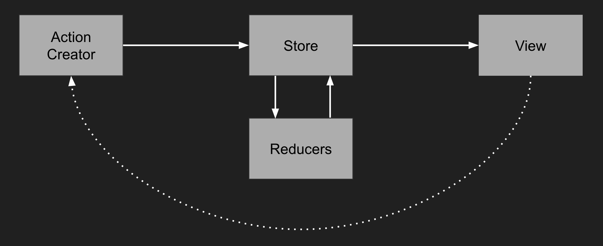
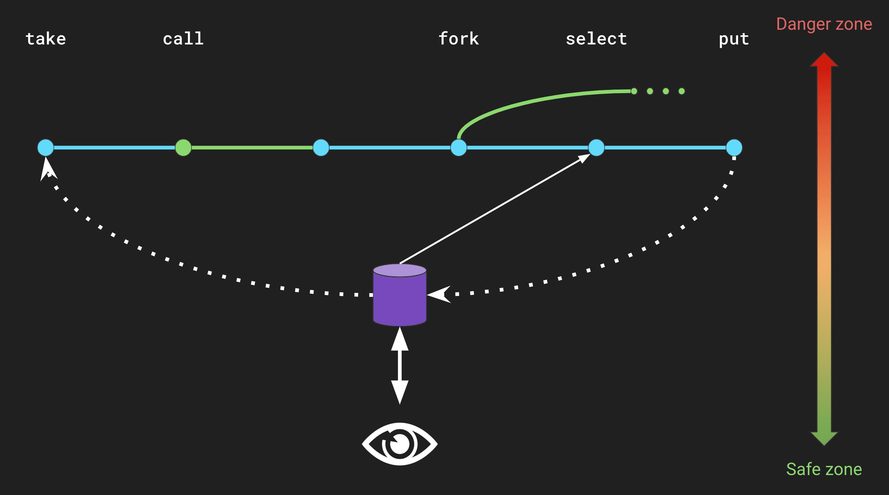

Let me get this out of the way : side effects are evil. Our job as developers is to build abstractions that solve
problems. We build independent, confined little worlds of abstractions that we can contol, understand and predict.
But at the end of the day, for most jobs, we need some connection to the chaos of the outside world. That's where
the trouble comes in. Side effects, being this necessary connection to the outside world, are unreliable,
hard to test and sometimes hacky. Any external API call, any storage interaction, any DOM event handler is adding
instability and incertitude to the perfect world you're striving to build.

Some of us have known this for long time now, and this is why clever people have come up with ways to deal with side
effects in applications : IO monads, Actors, isolated threads ... Redux Saga is one of these solutions. Redux Saga is a side-effects
model for Redux applications that makes side effects transactions easier to write, reason about and test. 

This article is the transcript to a talk I gave in Lille, France entitled _Redux Saga : side effects and scalability_.
Illustrations are slides form the presentation.

## Why does Redux Saga exist ?

If you're developing React applications, you may be used to performing your API calls directly in your components,
most likely in the `componentDidMount` hook. And perhaps this has worked fine so far. But today, I will try to demonstrate
how this approach keeps your application from scaling up, and why we need something like Redux Saga to build enterprise-class
applications.

### The importance of declarative programming

In order to explain the philosophy behind something like Redux Saga, I'd like to take a step back and look at the philosophy of
React and Redux and the impact they had on front-end development. If you started front-end development recently, you might not
realize this, but when React came out about 5 years ago, it changed the way we build front-end applications forever. Before it came
out, the de facto way of building JavaScript apps was to manipulate the DOM in a prodecural way, meaning every change of content, style,
color, every update of your UI had to be explicitly described. One had to think about everything, the code was verbose and hard to maintain.

React is, to my knowledge, the first library, to introduce **declarative programming** to the front-end world. Declarative programming can be
seen as the opposite of procedural programming : it is a programming pradigm in which programs are written with expressions that represent what
your program must accomplish in the end, instead of focusing on the succession of specific steps to get there. In other words, declarative
programming allows us to think about the *what* of our programs, instead of the *how*. 

Here's an example of how it would translate to JavaScript applications. 

#### The procedural approach

```javascript
const button = document.createElement('button');
button.textContent = 'Push me'
button.style = 'color:red;';
button.addEventListener('click', () => alert('Stop it'))
document.body.append(button);
```

Expresses the *how* : every UI change is explicit. The risk of desynchronization between the UI layer and the state of the
application is high. Unexpected behaviours can easily occur if this code is ran several times : if we are not cautious enough, the click
event listener could be registered multiple times, resulting in multiple `alert` being fired.

#### The declarative approach (with JSX)

```jsx
<button style={{color: 'red'}} onClick={() => alert('Stop it')}>
  Push me
</button>
```

Exresses the *what* : we simply declare what our program should look like at any given point in time, and React makes it happen. The view
layer and the state of our components are always in sync, and event listeners are handled so that there cannot be two of them on the same
component, for the same event at the same time. 

This approach is possible because React abtracts away the verbosity and complexity of the DOM for us, so we can focus on the looks and business
value of our applications.

In React applications, data flows from the statte to the view layer. This is what some functional programmers call *the React formula* :

| v = f(s)                                                                                      |
|:---------------------------------------------------------------------------------------------:|
| The view is a function of the state. Whenever the state evolves, the view evolves accordingly |

React is the first library to treat view components as functions. You can compose them the way you compose functions, 
you can make higher-order components, use currying ... Whenever the state changes, the view changes. If you treat your
components as pure functions, this synchronization is conceptually atemporal. Imagine your state
flowing from the top down through every component of your page. This makes the application far easier to reason about.

However, managing state is hard : if you're doing vanilla React, you've most likekly encountered this _components hell_ situation,
where sibling components are communicating through dozens of props and callbacks passed to their parent. You can easily lose the sense
of what's going on, and while newer features of React like the Context API aim at solving these issues, they remain insufficient for
most large-scale applications.

### Redux brings declarative programming at scale

Redux was made to tackle these state mangement issues, but not in any way. There is a consistency between React's philosophy of
declarative programming, and the way Redux manages the state of your application. State flows only in one way, allowing you to
reason about your program with ease.

Redux stores have three core properties : 
 - They are *predicatable* : it is always possible to know what your store will look like
 - They are *functional* : you can only update your store through the use of purely functional transforms. This makes
 Redux easier to test, since reducers are only pure functions
 - They are *inspectable* : Redux devtools allows you to inspect your store, see the actions that have been dispatched, and travel
 in time to understand what's going on
 
 As a reminder, here is how state flows in Redux applications :
 

 
### Redux Saga is the missing piece

So here we are : you've got yourself nice and pure view components, and a tidy Redux store that does the heavy lifting of managing your
state. You have built a nice world of abstraction where everything is at the right place and everything has been made predictable by the use
of awesome tooling, carefully designed layers and extensive unit tests. But you've forgotten the most painful, yet most important piece : effects.

Effects are what connects our applications to the outside world. In functional programming theory, we strive to avoid them as much as possible, but
in practice, they're indispensable. When you think about it, effects are what people pay you for. 

> If people still used business cards, I would print business cards [...] and the only thing the business card would say
is "Side effects"

Russ Olsen, [Functional Programming in 40 minutes](https://www.youtube.com/watch?v=0if71HOyVjY)

The thing is, people don't really care about the nice abstractions you've built, or the beauty of a line of code. They care
about the _effects_ of your code on the outside world. Having said that, we need a nice way to handle those effects that won't break
the purity of our view layer, or the predictability of our store. We need to treat side effects as the danger they represent, and
segregate them from the rest of our code.

### All the bugs in one place

Following this approach has one big advantage for developers : if you have properly handled side effects, then all the bugs you will
encounter in your application are most likely to come from this effectful part. I like to refer to this segregation of side effects as
an island :

> An island of side effects in a sea of purity

Side effects are an island in the middle of the sea. Except it's an island filled with all sorts of deadly creatures. When we get
to sagas, I will also refer to them as the _danger zone_, as opposed to the _safe zone_. The safe zone is your set of pure, properly tested
components. The danger zone is anything you can't control.

## How do sagas work ?

A saga is much like a transaction. It's a succession of effects that can be asynchronous calls, logging or storage manipulations. Sagas
can listen to some sort of event, usually the dispatch of a Redux action, and trigger effects automatically. Redux Saga is inspired by
_functional reactive programming_, so if you have already used something like event emitters, RxJS Observables or Cycle.js, you should feel
right at home. And you haven't, don't worry, you will get comfortable with it.

Redux Saga uses JS Generators to alllow you to write asyncronous code in a pseudo-synchronous style, which means no callback-hell. You can
also handle errors using try/catch like you would in synchronous functions. If don't know what generators are, 
[here's an article](https://www.sitepoint.com/javascript-generators-preventing-callback-hell/) to get you started. But you don't need to be
a generators expert to use Redux Saga :)

## Taking off


For the purpose of the talk, I built a little application that fetches fake flights from an API. The application has two main featurs :
being able to search for airports using autocomplete, and being able to retrieve flights from two different APIs.

You can download the project on my github
[right here](https://github.com/gbogard/online-flights). In this article, I won't get into how to install Redux Saga in your project. I invite
you to get a look at the `src/state/index.js` file of this project. You will see that Redux Saga is Redux middleware, that you install just like
you would Redux devtools.

### Fetching airport predictions using Redux Saga

This is a saga that searches airports given a query string. This is intendend to be used with an autocomplete field.
I'll explain in details how it works. 

```javascript
import axios from 'axios';
import {
  call,
  put,
} from 'redux-saga/effects'

export function* loadPredictions ({ payload: query }) {
  if (!query || query.length < 3) {
    yield put(setPredictions([]));
    return;
  }

  yield put(setIsLoading(true));
  
  try {
    const url = `http://autocomplete.travelpayouts.com/places2?term=${query}&locale=en&types[]=airport`;
    const { data } = yield call(axios.get, url);
    yield put(setPredictions(sanitizePredictions(data)));
  } catch (e) {
    console.error(e);
  } finally {
    yield put(setIsLoading(false));
  }
}
```

A saga is succession of effects inside a generator (a `function*`). Effects are functions that you need to `yield` from your saga. 
There are effects for calling external functions, spwaning new sagas from the current one, reading from the store, dispatching actions ...

The saga above contains contains two of the most common effect you will need : 

- **call** : calls another saga or a function that returns a promise and waits for the result. The rest of saga won't be executed until the function
resolves. Errors can be caught with a `try/catch` just like synchronous code.  Note that while this gives the impression of synchronicity, this does 
not block the event loop. If you've used `async/await`, you can think of this as `async/await` on steroids. The syntax for `call` is
`const result = yield call(function, ...arguments)`. Notice how we can use destructuring here to get the body of the response directly.
- **put** : dispatches an action to the store. This how you would mutate the state of your application after you've fetched the data you need. Here, we
are dispatching two different actions : `setIsLoading` shows the loader before the AJAX call starts, and hides it when 
it ends or when it fails. The `setPredictions` action replaces the predictions in the store with the result of our AJAX call. 

### Listening for events

Now we've got a nice saga to retrieve our predictions. There is one problem though : where does this `query` parameter comes from ?
Well, Redux Saga allows you to listen for events and execute a saga whenever the event fires. There are two types of events you can
listen for : the dispatch of an action or your store, and activity on a _channel_. Channels allow you to connect to external
events producers, they are much like _hot observables_ in RxJS. But for now, we will only listen for actions. 

```javascript
export default function* () {
  yield takeEvery(LOAD_PREDICTIONS, loadPredictions);
};
```

The code above basically says *whenever an action with the type `LOAD_PREDICTIONS` is dispatched, call the `loadPredictions` saga*. Then we can use `connect`
from `react-redux` to expose our `loadPredictions` action creator to our view layer, and bind our API call to the `change` event of an input. This is done
in the `src/pages/Home/index.js` file. The `loadPredictions` saga will receive the dispatched action as its argument. This is where our `query` comes from.
We're receiving an action of the form `{ type: 'LOAD_PREDICTIONS', payload: 'Paris' }`, and we're destructuring it to retrieve only `Paris` and assign it to
a `query` constant.

When used with a string, `takeLatest` will match against any action whose type equals to this string. However, it can match agains a variety of rules too : you can
match all actions, or actions that match a predicate e.g. any action that has a non-empty payload, or you can match against an array of the above rules. All of this
is explained in details in [the documentation](https://redux-saga.js.org/docs/api/#takepattern).

### Debouncing events

Our predictions system works, but it could be made better. Right now, we're triggering an AJAX call each time the user types a character, which isn't great
performance-wise. On autocmplete fields, you always want to use some kind of debouncing. Debouncing is waiting for the user to finish typing before triggering
the search. If you specifiy a debounce time of let's say a second, then every keystroke made within the same second will be sort of ignored. After a second
without typing, only the very last value of the field is taken into account for th search.

To debounce our search, we will need to change both the `loadPredictions` saga, and the the listener.

```javascript
const debounceTime = 500;

export function* loadPredictions ({ payload: query }) {
  if (!query || query.length < 3) {
    yield put(setPredictions([]));
    return;
  }

  yield put(setIsLoading(true));
  yield delay(debounceTime);
  
  const url = `http://autocomplete.travelpayouts.com/places2?term=${query}&locale=en&types[]=airport`;
  const { data } = yield call(axios.get, url);
  yield put(setPredictions(sanitizePredictions(data)));
  yield put(setIsLoading(false));
}

export default function* () {
  let task;
  while(true) {
    const action = yield take(LOAD_PREDICTIONS);
    if (task) {
      yield cancel(task)
    }
    task = yield fork(loadPredictions, action)
  }
};
```

Here we introduce three new effects from Redux Saga :

- *delay* : blocks the current saga for a given amount of time (in milliseconds)
- *fork* : calls another saga from within the current one in a non-blocking way, meaning the rest of the saga will be immediately executed instead of
waiting for the forked saga to return
- *cancel* : cancels a previously forked saga. The forked saga will jump directly to the end, ignoring any effect it would have otherwise executed.

Here's how the code above works : the combination of the infinte `while` loop, along with the `take` effect allows to reproduce the behaviour of the
`takeEvery` effect. At each keystroke we are cancelling the current instance of the `loadPredictions` saga if any, we are forking the `loadPredictions`
saga, and we are assigning it to a variable so we can cancel it if need be.

In the `loadPredictions` we are delaying the AJAX call by 500 milliseconds. This recipe allows us to debounce our AJAX call. Whenever a key is stroked during
the 500 milliseconds delay, the saga will be cancelled before the AJAX call gets a chance to be executed, and a new instance of the saga is forked, resulting in
a reset of the delay. This means there's is always a 500 ms delay between the last keystroke and the start of the AJAX call at any given time.

You can learn more abount debouncing in the [recipes section of the documentation](https://redux-saga.js.org/docs/recipes/).
 
### Running effects in parallel

Now that our saga is ready, we must talk about how to work with multiple sagas in an application. Redux saga requires you to
run a single saga, much like Redux wants you to provide a single reducer. In theory, you could handle all of your application's side effects in
a single saga. In practice though, you should strive for single responsibility sagas. Surely there must be a way to combine sagas into a single one.

Enter the parallel effect. 

The `all` effect takes an array of effects, and executes them in parallel. When you yield an `all` effect, the current saga is blocked until
either all the effects resolve, or one of them fails, just like how `Promise.all` behaves.

```javascript
// Example taken from the documentation
const [users, repos] = yield all([
  call(fetch, '/users'),
  call(fetch, '/repos')
])
```

To combine our sagas into a single one, we can do something like this :

```javascript
// src/state/sagas/index.js
export default function* () {
  yield all([
    airportPredictions(),
    flights(),
  ])
}
```

## Testing our sagas

There is one last thing we need to talk about before concluding this article : testing. So far we have talked about how unpredictable side
effects are compared to pure components, but that doesn't mean you shouldn't maximize your chances of getting your app working. One of the
main benefits of Redux Saga is that sagas are easy to test. Using [Redux Saga Test Plan](https://github.com/jfairbank/redux-saga-test-plan),
you can make assertions on the effects that your saga yields, mimic the content of your store, simulate the dispatch of actions, and even do
snapshot testing (i.e. save the textual representation of your saga to prevent regression).

Here is the test file for a saga called `loadFlights`. Can you guess what this saga does ?

```javascript
describe('loadFlights saga', () => {
  it('Should call the two providers with appropriate arguments.', () => {
    return expectSaga(loadFlights)
      .withState({
        flights: {
          flights: [],
          departureAirport: { code: 'CDG' },
          arrivalAirport: { code: 'NYO' },
          departureDate: 'DATE',
        }
      })
      .fork(loadFlightsFromFirstProvider, 'CDG', 'NYO', 'DATE')
      .fork(loadFlightsFromSecondProvider, 'CDG', 'NYO', 'DATE')
      .run(2000)
  });
});
```

Tests are a great way to document your code. Tests serve as a living documentation, one that is always up-to-date by nature.

- We start by defining the prequisites of our test. Here we use `withState` to mock the content of the store since the saga
relies on the content of the store to work properly.
- Then we make our assertions. Here we need to retrieve flights from two different APIs, so we check that two sagas are forked
by the saga under test with the appropriate arguments
- Finally we run our saga. For the sake of concision I chose not to mock anything, which means the tests will be executed against the real
APIs, that's why we need to provide a 2 seconds timeout as argument. This ensures that the test won't fail because of the APIs response time. In a real test,
you should mock any dependency of the saga under test, including external APIs. 

There is plenty to explore in [Redux Saga Test Plan](https://github.com/jfairbank/redux-saga-test-plan), and you use jest, you can also use
`jest.mock` and `jest.fn` to mock external dependencies, just like you would in any other test. I encourage you to always test your sagas, even if only
for documentation purpose. It should be clear, looking at the test file, what you're trying to achieve.

## The anatomy of sagas and the virtues of simplicity

As this article gets to an end, I'd like to take a step back at what we've learned so far, and give you a visual representation of how
Redux Saga fits in an application. 



This image shows the three layers of a React / Redux / Redux Saga application : the view, the state and the effects, all sorted by their level of
danger. You can see how the view layer communicates with the store, and how the store and the sagas interact :

- `take` listens to actions to start the saga
- `select` reads data from the store
- `put` dispatches an action to the store, resulting in the update of all the subsequent layers. You can get a feel of how data flows in the
application.

I've also added two of the effects we've seen so far : `call` and `fork`, that run other sagas or asynchronous functions in a blocking or 
non-blocking way respectively. You can represent sagas as branches, where effects can be run either in series or in parellell. You really don't need
much more to handle your application's logic. Redux Saga is yet not another framework : it gives this rather small set of fundamental tools,
that you can combine to achieve anything you want.

As a conclusion, I'd like to share with you this talk by Rich Hickey called 
[Simple made easy](https://www.infoq.com/presentations/Simple-Made-Easy), where he makes the distinction between simplicity and easiness, and
encourages us to build simple systems and strive for simple constructs, even when it seems harder at first. State is one of these complex
constructs, that make our applications less reliable and harder to reason about on a global scale. Overall, this talk is a nice introduction
to the value of abstractions and the virtues of purity.

Thank you for reading this article.
