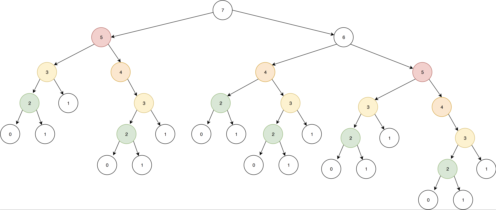

As powerful and appealing a tool is, it's always better to know a little about the cost of using it before doing so.
Recursion is no exception. Depending on the programming language you're using and the problem you're trying to solve, recursion
might not be most efficient way to go. I'll try to explain why in this article.

We will cover tail call elimination, memoized functions, as well as an example of inefficcient recursive function.

This post is a follow-up to a previous blog post I wrote called [Understanding Recursion](/blog/what-is-recursion). If you're not
comfortable with the concept of recursion, make sure you read this one first :) 

With that out of the way, let's dig in!

## Avoiding Stack Overflow errors using tail-recursive functions

In traditional recursion, each call of the function to itself adds a new element to the call stack, a data structure that
programs use to save data about active function calls. To simplify, the call stack represents what your program, or thread in
the case of parallel programming, is currently doing. When you enter a function, an element is added on top of the stack. When
this function exits, the element is removed from the top.

If you'd like to learn more about how the call stack works, I recommend you read
[this post](https://zhu45.org/posts/2017/Jul/30/understanding-how-function-call-works/) by Zeyuan Hu.

The call stack is limited in size. That's why when you forget the base case for your recursive function, you get a `Stack Overflow` error,
meaning that you cannot longer add calls to the stack.

In traditional iteration, with `for` or `while`, we don't have to bother with space efficiency that much, because all the iterations
will happen on the same stack frame, instead of creating a new one from the previous. Indeed, when an iteration ends, your program
merely _jumps back_ to the instruction it started at, kind of like a `goto` operation.

**As it turns out, some languages support the ability to convert nested calls to _jumps_, which avoids consuming frames on the
call stack**.

How so ? Thanks to a special kind of recursive function called _tail-recursive function_. A tail-recursive function is a function
whose very last instruction is to call itself. Many functionnal languages like Clojure or Scala have the ability to optimize
such functions so that they use constant stack space.

Remember our good friend the factorial function from [last time](/blog/what-is-recursion) ? Here's what it would look like in Scala,
in both _naive_ style and _tail-recursive_ style.

```scala
// This is the non tail-recursive one
def factorial(n: Int): Int = {
  if (n <= 1) {
    n
  } else {
    factorial(n - 1) * n
  }
}
```

The first one is very similar to what we had in Javascript. It's very easy to read implementation, but not that efficient.

### Wait, how is that not tail-recursive ?

You might think by looking at this function that it is tail-recursive. Indeed, the recursive call is on the last line of the
function. But that doesn't mean that it is the last instruction executed by your program. It becomes more obvious if we replace
the final multiplication by a set of several instructions :

```scala
def factorial(n: Int): Int = {
  if (n <= 1) {
    n
  } else {
    val previousFactorial = factorial(n - 1)
    previousFactorial * n
  }
}
```

You can see clearly here that the nested call the to `factorial` function is not in tail position. The result 
of the recursive call is needed before you can make the multiplication. You can see the multiplication itself as a function call,
where `n` and `factorial(n - 1)` are the arguments. Perhaps is it less confusing in languages like LISPs that do not
support the _infix_ operator, and where the multiplication is indeed a function like any other one.

```clojure
(* (factorial (- n 1)) 
    n)
```

### How do I write a tail-recursive function then ?

Here's the tail-recursive version of the factorial function in Scala. Notice how the last instruction
of the function is indeed the call to itself.

```scala
def factorial(n: Int, accumulator: Int = 1): Int = {
  if (n <= 1) {
    accumulator
  } else {
    factorial(n - 1, n * accumulator)
  }
}
```

The trick here is to add another parameter to our function called the `accumulator`. This `accumulator` will hold
the current result of the factorial. `n` will act as the compared value for our base case condition, just like before.

And just like that, our function is made more efficient. The idea behind the optimization of tail-recursive functions,
often referred to as _tail call elimination_ is that if the nested call is the last instruction, meaning there isn't anything 
left to do in the function, the program can just _exit_ the function and call it again with new parameters, just like regular
iteration.

### Visualizing tail recursion

Let's say we try to compute `!5` using both approaches. If we _hard code_ our function, we can get a good look
at what is going on under the hood.

#### Tail-recursion

```scala
factorial(5, 1)
factorial(4, 5)
factorial(3, 20)
factorial(2, 60)
factorial(1, 120)
120
```

You can see that the function can be easily rewritten as a succession of calls to the same function.

#### Not tail recursive

```scala
factorial(5)
(5 * factorial(4))
(5 * (4 * factorial(3)))
(5 * (4 * (3 * factorial(2))))
(5 * (4 * (3 * (2 * factorial(1)))))
(5 * (4 * (3 * (2 * 1))))
(5 * (4 * (3 * 2)))
(5 * (4 * 6))
(5 * 24)
120
```

Notice how each nested call has to be _expanded_ until all the results are _reduced_ into a single one.
You can get a feel of how this method uses the call stack. 

You might wonder why I'm putting parentheses here. This illustrates the order in which the operations
will actually be made by your program. While it is true that the arithmetic expressions `(5 * (4 * (3 * (2 * 1))))`
and `5 * 4 * 3 * 2 * 1` are equivalent, and that the latter is simpler, there is no way for our program to compute all
the multiplication in one go. Remember that the call stack is a _first in last out_ data structure. All the calls need to
be resolved in a specific order, and couldn't be simplified ahead of time.

### Why should I care ?

You might think that since your function doesn't deal with very deep levels of recursion, you will never encounter
a `Stack Overflow` error anyway. And you would be correct. So why bother with tail call elimination ?

Well the point of this optimization is not only to avoid `Stack overflow` errors. Keeping unnecessary items on the call stack
is expensive, both in space (a.k.a memory) and computation (a.k.a CPU power). Depending on your project and the type of device
you are targeting, you may or may not care about this. But you're doing low-level programming with high performance standards, or
if you're targeting small and slow devices, for instance if you're doing _IoT_, I would strongly recommend that you keep that in
mind.

## Where recursion falls short : recursive Fibonacci (a.k.a. the slowest Fibonacci algorithm)

Just like in the previous post, we will use a simple mathematical concept to illustrate the inner working of our
recursive function. This time, it's up to the Fibonacci sequence.

The Fibonacci sequence is defined as follows :

> F(0) = 0, F(1) = 1, and F(n) = F(n−1) + F(n−2) for all n ≥ 2

Simply put, it's a sequence of natural numbers where each value is the sum of the two previous ones. 
The first values of the sequence are `0, 1, 1, 2, 3, 5, 8, 13 ...`. This sequence has a number of interessting
properties, for instance it's deeply interconnected to the 
[Golden Ratio](https://en.wikipedia.org/wiki/Golden_ratio#Relationship_to_Fibonacci_sequence). But this is not
part of this blog post.

By looking at the sequence, you can imagine how, just like the 
factorial function, each value is computed upon the previous values and the sequence can go on forever. Thus,
a recursive approach to compute the nth number of the sequence seems to fit. You might even have encountered
this recursive fibonacci in text books, computer science classes or other blog posts. **However, it's possibly
the slowest fibonacci algorithm**.

Let's try it for ourselves by implementing a recursive fibonacci function :

```scala
def fib(n: Int): Int =
  if (n <= 1) {
    n
  } else {
    fib(n - 2) + fib(n - 1)
  }
```

This is a very straightforward implementation, very close to the definition we gave earlier. If you try
to run it with very small numbers like `6` or `10`. But try to run `fib(100)` and the program will run
for what seems like an eternity without giving you your result. This algorithm is so slow that it can't
even handle 3 digits numbers.

The reason for that is better explain visually. Here's what happens when we run `fib(7)` :




I've used colors to highlight identical nodes on the tree. Notice how the deeper you get in the tree,
the more leaves are being duplicated. As `n` grows bigger, the tree grows dramatically, which is why
you can't compute `fib(100)` in a reasonable amount of time.

This naive implementation does not allow us to reuse already computed results, which is highly
inefficient. So what can you do ? We're going to talk about three possible ways.

### Memoized functions

Let's say we want to reuse already computed results in order to avoid the duplication we've seen earlier.
One way to do it is via [Memoization](https://en.wikipedia.org/wiki/Memoization). A memoized function is a function
that caches its return value when it is called, so that each time you call it again with the same arguments, the stored
value is returned instead of being computed again.

Some languages, like Clojure, support this out of the box :

```clojure
;; Example by discoverfly on Clojuredocs

(defn fib [n]
  (condp = n
    0 1
    1 1
    (+ (fib (dec n)) (fib (- n 2)))))

;; Notice how we also modify the function so that it calls the memoized version of itself
(def memoized-fib
  (memoize (fn [n]
             (condp = n
               0 1
               1 1
               (+ (memoized-fib (dec n)) (memoized-fib (- n 2)))))))
               
(time (fib 30))
;; "Elapsed time: 17.914277 msecs"
;; => 1346269
(time (memoized-fib 30))
;; "Elapsed time: 0.697464 msecs"
=> 1346269
```

This gives us a tremendous improvement over the non-memoized version. In scala, there is no `memoize` function
in the standard library, but you can easily write one yourself.

```scala
def memoized[A, R](f: A => R): A => R = {
  var cache = Map.empty[A, R]
	(arg: A) => cache.getOrElse(arg, {
    val result = f(arg)
    cache = cache + (arg -> result)
    result
  })
}

val memoizedFib: Int => Int = memoized(n => {
  if (n <= 1) {
    n
  } else {
    memoizedFib(n - 2) + memoizedFib(n - 1)
  }
})
```

I'm using generics to create a `memoized` function that can work any
unary function. Of course it could be improved to work with more arguments as well.

Memoization is a quick and easy way to improve the performance of any expensive function
when you need to call it severral times. Be careful however not to overuse it. Memoization 
implies writing to some sort of shared state, which is harder to debug, harder to reason about, and
potentially expensive in memory. In short, you're sacrificing memory for performance, but that might
not always be an option.

Remember also that memoization should **only be used with pure functions**, as any side effect you put
in here will only be exctuted once per argument set.

### Dynamic programming

Another way to optimize the computation of the fibonacci sequence is through a method called
_dynamic programming_. This one would require several posts of its own, so I'm not going to get into
many details, but simply put, dynamic programming is a technique in which you break a problem into smaller
sub-problems and store the result of each sub-problem so it can be reused if needed. In fact, one could
describe memoization as a specific type of dynamic programming.

The point heres is you might not need recursion altogether. To compute the fibonacci sequence, you can instead
compute all the results in order and store them in an array, and literally rely on the two previous values to compute
a new one.

```scala
def fib(n: Int): Int = {
  var results = (0 :: 1 :: Nil).to[scala.collection.mutable.ListBuffer]
  for (x <- 2 to n) {
    results += (results(x - 1) + results(x - 2))
  }
  results(n)
}
```

In order to maximize performance, be careful to store your results in a data structure that
supports constant time appending, something like a linked-list. In scala, the `ListBuffer` provides
constant time appending, as stated by this
[performance characteristics overview](https://docs.scala-lang.org/overviews/collections/performance-characteristics.html).

This is not my favorite method, as it involves mutable data structures and a for-comprehension, but it's a pretty common
way to solve this problem and if you like a more procedural approach, you'll feel right at home.

### Finally, have a unique insight

There are far better ways to compute the fibonacci sequence than any one we've seen in this article so far.
Sometimes, in order to find the most efficient solution to a problem, it takes a truly good idea and some
mathematical knowledge.

There are ways to compute the fibonacci sequence that rely on matrix exponentiation, and they perform far
better than the one we've seen so far. But I'm going to be honest here, I don't have the knowledge to understand
those methods fully, let alone explain them. But for those who are better at math than I am, a developer named
[Nayuki (@nayuki on Github)](https://www.nayuki.io/) has put together a comprehensive round-up of [fibonacci algorithms and their performance
characteristics](https://www.nayuki.io/page/fast-fibonacci-algorithms). You will get detailed benchmarks of the algorithms
we've seen today, as well as faster algorithms.

If you don't have the unique insight it takes to solve a problem efficiently, maybe someone else will. It is
always a good idea to check out whether has already solved your problem, inspect how efficiently they've done it, and ask
yourself how you can make it better if you can. 

I hope this article has helped you understand how recursive functions can be made more efficient. Remember
recursive functions can be represented in the shape of a tree. When writing a function, try to make a simple drawing
of its execution as it will help you spot potential duplication. 

Thank you for reading.
