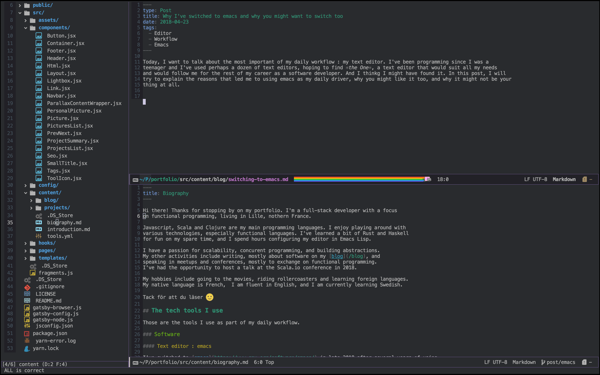

Today, I want to talk about the most important of my daily workflow : my text editor. I've been programming since I was a
teenager and I've used perhaps a dozen of text editors, hoping to find *the One*, a text editor that would suit all my needs
and would follow me for the rest of my career as a software developer. And I thinkg I might have found it. In this post, I will
try to explain the reasons that led me to using emacs as my daily driver, why you might like it too, and why it might not be your
thing at all.

## Don't underestimate the value of a good setup

The job of developer involves a lot of reading and writing : code, essays, blog posts, documentation ... 
I pretty much spend my day reading and manipulating text on a screen. It isn't very flattering to say it that way,
but I think it's true. Knowing this about our job allows us to think about the nature of the tools we need. As developers,
we should never underestimate the importance of a good text editor, a good keyboard, or a good screen. 

For me, the ideal setup is a big, well-defined screen without too much glare, a solid mechanical keyboard with tactile switches,
a good chair, and of course a good text editor. My text editor should suit all my programming languages, be customizable, have a strong
community of users and shouldn't use too many resourcces on my system so I can take all the power I need to write, test, compile and run
code.

## To all the editors I've loved before

In my career as a developer so far, I've worked with many languages, many libraries, and, you've guessed it, many text editors. I've used some
of those editors for several years and each of these editors brought something new to my workflow.

- Sublime Text was the first editor to introduce me to multiple cursors, fast navigation and plugin in an editor. I've used it for HTML,
Javascript
- Webstorm was my first fully-featured IDE. With it I discovered the joy of code completion and inline errors and  learned how to debug programs step-by-step
among other great features
- Atom and VS Code introduced me to Electron-based extensible editors. They had pretty much all the features of Sublime, plus code-completion and debugging (at least
it worked for Javascript) and had support for many programming languages and additional features through a huge set of plugins developed by the community. VS Code is proably
the most used text editor today, at least in the Web development world, and remains a very solid choice for Javascript developers.

### And then I discovered Scala

If I had remained only a front-end developer, I'd probably have been fine using VS Code as my daily-driver. But I'm also a functional programming passionate, especially so since
I've discovered this wonderful language called Scala. The issue is, as much as I love Scala, tooling and editor support isn't really its strong suit compared to more mainstream languages.
When you want to build software using Scala, you don't have so many options : either used Intellij IDEA, or configure ENSIME, a language server for Scala, and use it with one of its supported
editors. The thing is, back when I was just discovering Scala, learning the language was difficult enough on its own, I didn't want to invest time in configuring an editor that would have been
way less compelling than an IDE anyway.

Intellij IDEA is the _de facto_ IDE for Scala developers. It has state of the art language support with very important features such as completion, automatic imports and debugging. It shares many
features and keybindings with other Jetbrains products, such as Webstorm which I've mentionned before, and features the same level of Javascript, React and Vue support Webstorm does. At first,
it really felt like a perfect fit.

Intellij IDEA is a great product, unfortunately, it comes at a significative cost. For starters, it's a proprietary software meaning you can't customize it so easily, and it's a paid
product, which means you need a recuring subscription to use it. It comes in a free _community version_ but this one does not feature the advanced Scala support of the _Ultimate_ version.
The other significative cost of Intellij is system resources. This IDE, like all Jetbrains products I know of, is built entirely in Java. It is relatively heavy in CPU usage, and particularly
heavy in memory usage. Intellij was slow to start, like all JVMs, and made my laptop overheat. It also used memory resources I wish I had left for Docker containers, terminals, and other
applications. Eventually, I got tired of paying my monthly subscription and figured that I could do with something a little more lightweight. And I thought "why not emacs ?".

## emacs is very versatile

Versatility is perhaps the most important benefit of using emacs. Emacs is not only a text editor capable of handling any language syntax, it is also, thanks to its
huge amount of community-driven packages, a true swiss army knife that can handle many of your daily computing tasks.

### emacs can do it all

When it comes to programming, emacs support almost any language you can think of. Here's a glimpse of what emacs has to offer :

- State of the art support for Javascript, Typescript and JSX featuring the same language server VS Code uses for completion (tide)
- Very powerful structural editing for LISPs and pairs of characters in general through Paredit
- State of the art Clojure support including inline code evaluation, REPL integration and debugginf through CIDER
- Excellent Scala support through ENSIME and more recently Metals
- Syntax highlighting for virtually any language with a variety of color schemes

As an example, here's how autocmpletion works for Scala in Spacemacs using the Scala layer.

But emacs isn't just about programming. In fact, the editor is often mocked to be so extensible it can behave like an operating system of its own. Using
a variety of packages, you can turn emacs into a powerful e-mail client, an organizer, a calendar, a terminal emulator, or even a window manager for X on Linux!
You must also keep in mind that emacs is an old editor, born way before we had graphical interfaces everywhere. This implies two things : the first one is that
emacs can run on a terminal, meaning you can have all the abovementionned features directly on a server. The second thing is that emacs, though it gained
support for mice during its evolution, is primarily meant to be used with a keyboard, which can be life-changing for productivity once you get passed the
initial learning curve.

### emacs is a better vim

Now I know some people might hate me for this statement, but I really find it true. Vim is a great piece of software, and many developers are partial to its modal editing philosophy, but it vim doesnt't have the versatility of emacs, not even close.
Well it turns out emacs has a very powerful _evil mode_ that brings vim's modal editing and keybindings to emacs. This way you can have the productivity of vim coupled with the arguably
superior customizability and versatility of emacs. Granted, it might require a few tweaks here and there since many packages are built with emacs' keybindings in mind, but the community
as done most of the job already, so you can enjoy Org mode, or MELPA or most of emacs' famous packages with vim keybindings without too much effort. And if that's your thing, you can even
use [Spacemacs](http://spacemacs.org/), am opinionated distribution of emacs that aims at providing the best of both worlds without the hassle of configuration.

## emacs is very customizable

## emacs is free as in freedom

emacs is a free software released under the gnu license. in fact, it is even one of the oldest open-source projects still actively maintained to this day. the earliest version of emacs goes back
to 1976 ! emacs' licensing means you're free not only to use the software any way you want, but to read, modify and distribute its source code. and contrary to vs code, [whose binaries come with
trackers](https://vscodium.com/#why), emacs has a straightforward licensing and will not track you.

## emacs might not be right for you

Alright, I think you get the idea : emacs is great. I've been telling you since the beginning of this article and you might be tired of it. Now where's the catch ?
Why isn't every developer using emacs ? Well, As much as I love the editor, I must admit it is kind of niche. Emacs is not for everyone. Here are some of 
the reasons why I think so :

- **People are not so confortable with using their keyboard**: nowadays we get excellent mice and trackpad. Most of us never had to use an application that was all
keyboard and no mice, and suprisingly enough, many developers I know aren't so comfortable with typing. Using a terminal based editor like emacs or vim requires
to think diffrently about how you interact with your editor, which brings me to the next point.
- **Productivity comes at the cost of a stiff learning curve** : I'm convinced that mastering your editor's keybindings brings your productivity to whole new level.
Once all the commands are in your muscle memory, the editor becomes like an extension of your brain. But until then, memorizing all the commands will make
you feel slow and clumsy. Some of the commands will sollicitate your finger muscles in ways you weren't used to, possibly causing you pain at first. All of
this make newcomers wonder "Is all that worth it ?" and eventually they go back to their comfort zone. You have to be aware that the first month of using emacs
will be difficult and the benefits hard to see.
- **Elisp can be hard** : elisp (emacs-LISP) is the language in which and for which emacs was originally written. All configuration files and all _plugins_
in emacs are written in elisp, meaning if you choose to use emacs, you will be confronted to it eventually. Writing configuration files in elisp isn't
particularly hard, but it can be confusing when you know nothing about LISPs. Moreover, while installing packages shouldn't be an issue for most people, having
those packages work exactly the way you want (by customizing keybindings or tweaking packages to make them work nicely together) can get a bit messy if
you're not comfortable with it.
- **You might not want to invest so much in an editor** : mastering a new tool and tweaking your workflow to fit it yo your needs requires time and a significant
amount of effort, one you might not be williing or able to make. The truth about emacs is that it is so customizable and so versatile that people spend years
refining their configuration. There's something new to learn everyday. As a consequence, "using emacs" dosen't make that much sense, since most emacs users
are not productive using someone else's setup.

## Ok, where do I start ?

With all that said, if you're ready to make the jump. there are some resources to get you started. The _stock emacs_ is very barebone, but fortunately, there
premade configuration out there that come with some of the most useful plugins and some better keybindings.
You can check out [Prelude](https://guillaumebogard.dev/blog/discover-redux-saga/), a popular emacs distibution that ships with some popular packages and
improvements. I also encourage you again to checkout Spacemacs, a distribution that lets you choose between Vim editing style and more classic emacs bindings
while bringing improved commands and easy support for many technologies through its _layer_ principle. Spacemacs is designed for consistency and mnemonics,
meaning it will usually be a great fit for newcomers that want to get started quickly while remembering the most important key bindings more easily.

Also, don't hesitate to reach out to the community. There are plenty of Youtube videos and articles out there to get you started, and the editor
as a very vibrant community on Github and Reddit, constantlty sharing packages and configurations and exchanging about their workflow.

