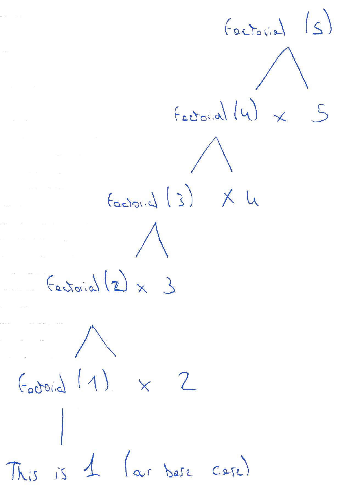

Recursion is an essential part of the functional programming tool set. It allows breaking down complex problems into a possibly
indeterminate number of subproblems. It is often used as a functional alternative to loops
in the imperative world, because it allows, among many other things, to loop over elements
of a data structure, while preserving the immutability of your state.

This post is the first one of two posts about recursion. The first will cover the basic definition of recursion
and some simple use cases, the second one will introduce performance considerations of recursive functions.

#### TL;DR;

A function that calls itself, directly or indirectly, is called a recursive function. The factorial function, or the Fibonacci sequence are
common examples of problems that can be computed using recursion, but recursion has many more use cases e.g. directory structures in file systems,
validation and transformation of nested data structures.

### The factorial function

The factorial function is good example to understand recursion. According to Wikipedia :

> The factorial of a positive integer n, denoted by n!, is the product of all positive integers less than or equal to n.

Or to put it in a more _imperative_ manner : to calculate the factorial of the positive
integer n, you need to multiply all whole numbers from n down to 1.

How would you calculate the factorial of let's say 5 ? Just multiply 1, 2, 3, 4 and 5 together.

|    |   |                   |
|----|---|-------------------|
| 5! | = | 1 x 2 x 3 x 4 x 5 |
|    | = | 2 x 3 x 4 x 5     |
|    | = | 6 x 4 x 5         |
|    | = | 24 x 5            |
|    | = | 120               |

If you want to know the factorial of `6`, just multiply that by 6, and for the factorial of `7`, you guessed it,
multiply `6!` by `7`. If we put those results in a table, we begin to see a pattern emerging.

| n | !n                |         |       |
|:-:|:-----------------:|:-------:|-------|
| 1 | 1                 |         |       |
| 2 | 2 x 1             | = 2(1!) | = 2   |
| 3 | 3 x 2 x 1         | = 3(2!) | = 6   |
| 4 | 4 x 3 x 2 x 1     | = 4(3!) | = 24  |
| 5 | 5 x 4 x 3 x 2 x 1 | = 5(4!) | = 120 |

We can observe that each row in our table relies on the previous one, except for the first row, which is called
the base case of the recursion. What it means is if we need to compute the factorial of any positive integer `n`,
we start by computing `!(n -1)`, itself requiring computing `!(n - 2)` and so on, until we reach our base case
of `!1 = 1`.

#### The code

This is how we would implement the recursive factorial function in JavaScript.

```javascript
const factorial = n => {
  if (n <= 1) {
    return 1
  }
  return factorial(n - 1) * n
}
```

Note that it can be made even more concise by using a ternary operator :

```javascript
// This is equivalent
const factorial = n => n <= 1 ? 1 : factorial(n - 1) * n
```

What you notice immediately is that the `factorial` function we defined is calling itself. If you try to run `factorial(5)`,
you get the expected result of 120. So what is happening exactly ? As long as our condition `n <= 1` is false,
each call to the `factorial` function is expanded to another call to itself. When we finally reach our base case, that is when
our condition is true, the `factorial` function is not called anymore.

These nested calls can be represented by a tree, as illustrated by the schema below :



You can see from the schema that computing `factorial(5)` requires 4 nested calls to `factorial`. The higher the
factorial you want to compute, the taller the tree gets. For any positive integer n, computing `factorial(n)` requires `n - 1`
nested calls.

#### What happens when we forget the base case ?

Let's take our previous code and remove the condition from it, leaving only the recursive call like so :

```javascript
const factorial = n => factorial(n -1) * n
```

When we try to run this function, we end up getting a RangeError, or in other languages a StackOverflow error :

```
RangeError: Maximum call stack size exceeded
at factorial (vumoheguzo.js:1:24)
...
```

Since we removed our condition, our call to the `factorial` function gets expanded into an infinite number of nested calls, just like a `while` loop that would
never exit. But the memory you're allowed to allocate in your program is limited. At some point, your Javascript engine (or JVM, or whatever environment you're in)
will prevent you from doing more nested calls, and notify you with this exception, indicating that you've reach the maximum call depth allowed.

Most of the time, this indicates a recursive function that never exits because of a missing or incorrect base case. However, in some rare cases, 
it can be that your function is correct, but the computation you asked for is so complex that it actually requires more calls than your environment can handle. 
Javascript is probably not the best choice for those complex computations. There are ways to prevent stack
overflow errors in other languages, but that will be discussed in the next post.

### OK, factorials are cool, but can you teach me something actually useful ?

Factorials are a great way to understand the basic principles of recursion, but there's little chance that you will actually need them in your projects,
unless they are related to mathematics. But there are many use cases for recursion, no matter what you're building. One very common use case is
the transformation of arbitrarily nested data structures.

Let's suppose you want to send data over a network. Bandwidth is expensive and data transfers are slow, so you want to minimize the amount 
of data that is actually transferred. You already know that the objects you need to send might contain `null` values you don't care about, 
so you want to filter those `null` values before sending the objects over the network.
The problem is you don't know the exact shape of your objects in advance. They could contain any amount of nested objects. 
This is a perfect use case for recursion!

Let's write a JavaScript function that will do exactly what we need :

```javascript
const isObject = value => Object(value) === value

const removeNullValues = object =>
  Object.entries(object).reduce((acc, [key, value]) => {
  // When the value is null, we strip it out
  if (value === null) {
    return acc
  }
  // When the value is an object, we strip out null values
  // recursively by making a nested call
  if (isObject(value)) {
    const filteredValue = removeNullValues(value)
    // We also strip out empty objects from the result
    if (Object.entries(filteredValue).length === 0) {
      return acc;
    }
    return { ...acc, [key]: filteredValue }
  }
  // In every other case, we leave the value as it is
  return { ...acc, [key]: value }
}, {})
```

By using a combination of `reduce`, recursion, and a spread operator, we are able to remove null values from any object, in just about 15 lines of code, in a purely
functional matter (no mutability or side effects involved).

```javascript
removeNullvalues({
  foo: 'foo',
  bar: null,
  baz: {
    qux: null,
    quux: 'quux',
    corge: {
      lorem: null,
      ipsum: null,
      dolor: {}
    }
  }
})

// [object Object] {
//   baz: [object Object] {
//     quux: "quux"
//   },
//   foo: "foo"
// }
```

You'll notice by looking at this example that our function not only removes null values, but also empty objects. You could tweak it to work with arrays as well (removing null values from arrays
and objects inside arrays recursively), or you could implement something totally different : transforming snake case strings to camel case recursively, filtering unwanted keys from an object ...
Possibilities for transforming data with recursion are endless !

I hope you liked this introduction to recursion. It can be confusing at first, but by practicing, you will soon find them very natural.
The more you get to know recursive functions, the easier you will be able to identify and solve recursive problems. 

In a second post, we'll talk about tail call elminiation, and some issues you can encounter when using recursion (and also when not to use it).

Thanks for reading
